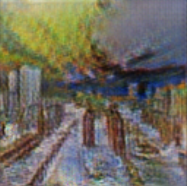

# StyleTransfer
## Decriptions
This project implements style transfer using **CycleGAN**, a model designed for unconditional image-to-image translation. CycleGAN enables style transfer between two image domains without requiring paired images from the source and target domains.

These are examples of cross domain image transfer - we want to take an image from an input domain  Di and then transform it into an image of target domain  Dt without necessarily having a one-to-one mapping between images from input to target domain in the training set. Relaxation of having one-to-one mapping makes this formulation quite powerful - the same method could be used to tackle a variety of problems by varying the input-output domain pairs - performing artistic style transfer, adding bokeh effect to phone camera photos, creating outline maps from satellite images or convert horses to zebras and vice versa! This is achieved by a type of generative model, specifically a **Generative Adversarial Network** dubbed **CycleGAN** by the authors of [this](https://arxiv.org/abs/1703.10593) paper. Here are some examples of what CycleGAN can do.

## CycleGAN Architecture
CycleGAN is composed of four main components: two generators and two discriminators. These components work together using **adversarial loss** and **cycle consistency loss**.
### Generator
The CycleGAN models use two generators, G and F. G translates images from domain X to domain Y, and F translates the images back from domain Y to domain X . This is what forms a cycle.
### Discriminator
There are two discriminators, DX​ and DY, one for each generator. DX​ differentiates between real images from domain X and fake images generated by F. DY​ differentiates between real images from domain Y and fake images generated by G.

### Adversarial loss
The adversarial loss is a crucial component of CycleGAN and any other GAN model, driving the generators and discriminators to improve through competition.

* **Generator Loss**: The generator aims to fool the discriminator by generating realistic images. The generator’s loss measures the success of fooling the discriminator.
* **Discriminator Loss**: The discriminator aims to classify real images and generate images correctly. The discriminator’s loss measures its ability to distinguish between the two.

### Cycle Consistency Loss

The cycle consistency in CycleGAN is crucial as it ensures that an image from one domain, translated to another and back, resembles the original. This loss is important for preserving the integrity of images and enables image-to-image translation across domains without paired data through cycle-consistent adversarial networks.

### Combined loss
In CycleGAN, the combined loss is an amalgamation of the adversarial loss and the cycle consistency loss. This combination allows CycleGAN to generate realistic transformations between unpaired domains, minimizing arbitrary changes and mode collapse issues that might arise if only one loss type is used.

## Project structure

- **latest_checkpoint/download.txt**: A text file containing link for downloading  pre-trained models.
- **model/CycleGAN/auxiliary.py**: Сontains helper classes that assist in building model.
- **model/CycleGAN/discriminator.py**: Houses the implementation of the discriminator neural network used within the CycleGAN architecture.
- **model/CycleGAN/generator.py**: Contains the code for the generator neural network, responsible for image transformations in CycleGAN.
- **optimizer**: Directory related to the optimizers used to train the model.
- **scripts/train.py**: The main training loop to execute the model training process.
- **utils/data_loader.py**: Responsible for handling the loading and preprocessing of datasets used by the model.
- **utils/hyperparameters.py**: Contains the definition of hyperparameters.
- **utils/init.py**: Contains initialization of the model weights.
- **utils/visualization.py**: Contains function for visualizing the images.
- **requirements.txt**: A list of Python packages required to run the project.

## Results 
The model was trained on the [Monet2Photo](https://www.kaggle.com/datasets/balraj98/monet2photo/data) dataset to style the source image to the Monet domain.

Example of style transfer result:

- Original Image:

- Style Transferred Image:

## Libraries used

- torch
- tqdm
- torchvision
- matplotlib
- kagglehub
- numpy
- pillow
- scikit-image

## References

- [Understanding and Implementing CycleGAN in TensorFlow](https://hardikbansal.github.io/CycleGANBlog/)
- [CycleGAN: How AI Creates Stunning Image Transformations](https://viso.ai/deep-learning/cyclegan/)
- [Unpaired Image-to-Image Translation using Cycle-Consistent Adversarial Networks](https://arxiv.org/abs/1703.10593)
